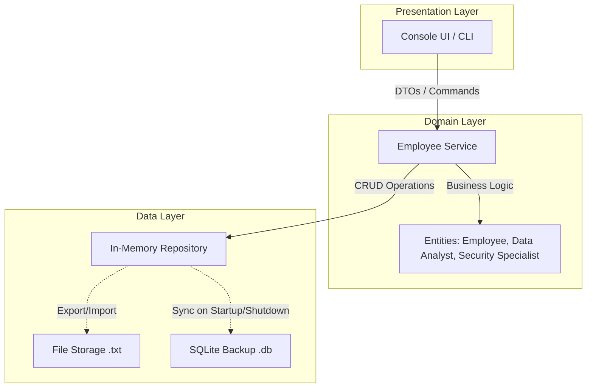
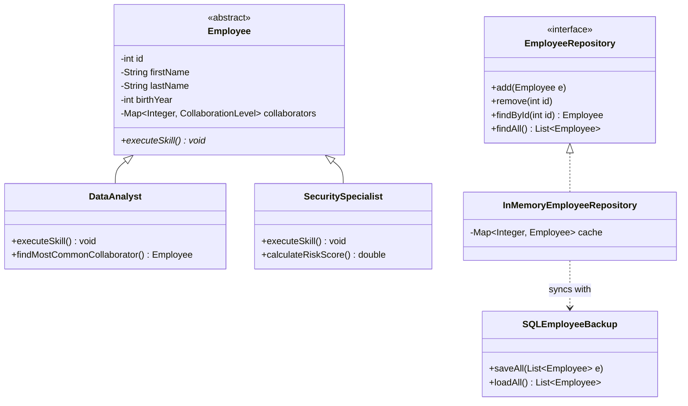

# Enterprise-Grade Employee Management & Security Auditor

> **Architecture & Engineering Showcase**
> *"Any fool can write code that a computer can understand. Good programmers write code that humans can understand."* 
> 
> This project originated as a university assignment but was executed with a high-level engineering mindset. The goal was to move beyond "code that works" and build a robust, scalable, and decoupled system.

---

## 🏗️ Architectural Philosophy

I implemented a **Layered Architecture** to ensure a strict Separation of Concerns (SoC). By decoupling business logic from infrastructure, the system remains flexible—allowing the swapping of the Console UI for a Web API or the SQL backup for Cloud Storage without altering core domain rules.

### The System Layers:
- **Presentation Layer**: A CLI-based interface focused on strict input validation and user experience.
- **Domain Layer**: The "Brain" of the system. Contains core business logic, polymorphic entities (Data Analysts, Security Specialists), and service orchestrators.
- **Data Layer**: A hybrid persistence model. It utilizes an In-Memory Cache for real-time performance and an SQLite/File-based synchronization mechanism for non-volatile storage.



---

## ⚡ Engineering Challenges & Decisions

### 1. Optimization over Iteration
I consciously avoided the "junior" pitfall of iterating through entire datasets in Java for every query.
- **The Strategy**: I offloaded complex aggregations to the SQL engine where possible or utilized highly efficient Java Streams for in-memory processing.
- **Result**: Minimized CPU cycles and ensured the system remains performant even as the dataset scales.

### 2. The Deterministic Tie-Breaker
A critical issue arose during network auditing: non-deterministic results when two employees had an identical number of connections.
- **The Issue**: Standard `max()` functions return a random entry in case of a tie, which is unacceptable for security-focused data.
- **The Engineering Fix**: Implemented a secondary ID-based comparison to act as a "pull-up resistor," ensuring the output is always deterministic and stable.

### 3. Architecture vs. Language Features
- **The Trade-off**: I initially considered using Java 17 sealed interfaces for employee types but found they constrained the flexibility of the package structure.
- **The Decision**: I prioritized architectural clarity and decoupling over a specific language feature, opting for standard interfaces and abstract classes to maintain a clean, multi-package layout.

---

## ✨ Technical Highlights & Features

- **Hybrid Persistence Model**: In-memory performance with reliable SQL "Black Box" backup on shutdown. The application can run entirely offline or seamlessly sync with the local SQLite database.
- **Polymorphic Employee Skills**:
  - **Data Analysts**: Capable of executing algorithms to determine which collaborator shares the most mutual connections.
  - **Security Specialists**: Utilize a custom, weighted risk-scoring algorithm factoring in the number of connections, average connection quality (Poor, Average, Good), and isolation penalties for nodes with few connections.
- **Advanced Statistics & Analytics**: Instant lookup for the prevailing quality of collaborations and the most connected employees.
- **Type-Safe Data Transfer**: Leveraging Java Records for immutable and efficient data flow between layers.
- **Robust Error Handling**: A custom Exception hierarchy designed for system stability and clear developer feedback.

---

## 📊 System Overview



---

## 🚀 Setup & Installation

1. **Clone the Repository**:
   ```bash
   git clone <repository-url>
   cd DatabazovySystemZamestnancu
   ```

2. **Database Configuration**:
   The system uses an embedded **SQLite** database (`employees.db`). No external server setup (like MySQL or PostgreSQL) is required. The database schema and tables will be initialized automatically if they do not exist.

3. **Build the Project**:
   ```bash
   ./gradlew build
   ```

4. **Run the Application**:
   ```bash
   ./gradlew run
   ```
